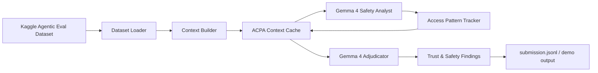

# Context Pruning for Gemma 4 Trust & Safety

This repository contains a Kaggle-ready Trust & Safety prototype for the
[Gemma 4 Good Hackathon](https://www.kaggle.com/competitions/gemma-4-good-hackathon).
It uses Gemma 4 as the reasoning model, the Kaggle Agentic Eval dataset as the
evaluation input, and an Adaptive Context Pruning Algorithm (ACPA) to keep
agentic safety reviews grounded while reducing noisy context.

## What this builds

- A Trust & Safety review pipeline for agent traces, prompts, and model outputs.
- A complete implementation of **Adaptive Context Pruning Algorithm (ACPA)** with
  LFU/LRU hybrid cache eviction and pinned citation/dependency preservation.
- A Gemma 4 client that reads API keys from config files instead of hard-coding
  secrets.
- A flexible Agentic Eval dataset loader for Kaggle input directories.
- A Kaggle notebook entrypoint and a Mermaid architecture diagram.

## Architecture

See [`docs/architecture.md`](docs/architecture.md) for the full diagram and
component notes.



## Repository layout

```text
configs/
  app.example.toml       # Non-secret defaults
  secrets.example.toml   # API key shape; copy to secrets.toml locally/Kaggle
docs/
  architecture.md        # Mermaid architecture diagram and design notes
notebooks/
  context_pruning_kaggle_runner.ipynb  # Kaggle Run All notebook with diagnostics
  kaggle_submission.py   # Kaggle notebook/script entrypoint
src/acpa_gemma/
  acpa.py                # Adaptive Context Pruning Algorithm
  benchmark.py           # Offline ACPA-vs-baseline pruning benchmark
  cli.py                 # Command-line runner
  config.py              # Config and secret loading
  data.py                # Agentic Eval dataset loader
  gemma_client.py        # Gemma 4 API wrapper
  pipeline.py            # End-to-end Trust & Safety pipeline
  prompts.py             # Gemma prompts and output schema
tests/
  test_acpa.py
  test_config.py
```

## Configuration

Copy the example files and add your key locally or in the Kaggle notebook's
working directory:

```bash
cp configs/app.example.toml configs/app.toml
cp configs/secrets.example.toml configs/secrets.toml
```

Edit `configs/secrets.toml`:

```toml
[gemma]
api_key = "YOUR_GOOGLE_AI_STUDIO_OR_GEMINI_API_KEY"
```

The code searches these config files by default:

1. `configs/app.toml`
2. `configs/secrets.toml`
3. `/kaggle/working/configs/app.toml`
4. `/kaggle/working/configs/secrets.toml`
5. `~/.config/acpa_gemma/config.toml`
6. `~/.config/acpa_gemma/secrets.toml`

No API key is committed to this repository.

## Local usage

```bash
python3 -m venv .venv
source .venv/bin/activate
pip install -e ".[dev]"

python3 -m acpa_gemma.cli \
  --config configs/app.toml \
  --secrets configs/secrets.toml \
  --input /kaggle/input/agentic-eval \
  --output outputs/submission.jsonl
```

For a no-network smoke test:

```bash
python3 -m acpa_gemma.cli --dry-run --sample-size 3 --output outputs/dry_run.jsonl
```

For an offline pruning benchmark:

```bash
python3 -m acpa_gemma.benchmark \
  --input /kaggle/input/agentic-eval \
  --sample-size 100 \
  --details-output outputs/benchmark_details.csv \
  --summary-output outputs/benchmark_summary.csv \
  --report-output outputs/benchmark_report.md
```

## Kaggle usage

1. Create a Kaggle notebook for the Gemma 4 Good Hackathon.
2. Attach the Agentic Eval dataset to the notebook.
3. Upload or clone this repository.
4. Copy `configs/secrets.example.toml` to
   `/kaggle/working/configs/secrets.toml` and add your Gemma API key.
5. Run:

```bash
python3 notebooks/kaggle_submission.py \
  --input /kaggle/input/agentic-eval \
  --output /kaggle/working/submission.jsonl
```

You can also use `notebooks/context_pruning_kaggle_runner.ipynb` inside
Kaggle. Its dataset locator prints attached input diagnostics and continues
with a demo record for dry-run/benchmark cells when only placeholder files such
as `NOTE.md` are present; attach the real Agentic Eval records before running
the live Gemma API cell.

## Trust & Safety output schema

Each processed Agentic Eval record produces JSON with:

- `record_id`
- `risk_level`: `low`, `medium`, `high`, or `critical`
- `categories`: safety categories such as prompt injection, privacy,
  cyber abuse, fraud, or self-harm.
- `evidence`: short grounded snippets retained by ACPA.
- `mitigations`: actionable safety controls.
- `acpa_stats`: pruning and dependency-preservation telemetry.

## Why ACPA for this track

Agentic safety traces can be long and noisy. ACPA keeps frequently used,
important, recent, and citation-bearing context while evicting cold context.
This makes Gemma 4 reviews more focused and provides explainable memory
telemetry for transparency and reliability.