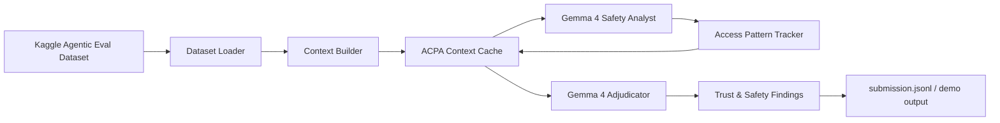

# Context Pruning for Gemma 4 Trust & Safety

This repository contains a Kaggle-ready Trust & Safety prototype for the
[Gemma 4 Good Hackathon](https://www.kaggle.com/competitions/gemma-4-good-hackathon).
It uses Gemma 4 as the reasoning model, the Kaggle Agentic Eval dataset as the
evaluation input, and an Adaptive Context Pruning Algorithm (ACPA) to keep
agentic safety reviews grounded while reducing noisy context.

## What this builds

- A Trust & Safety review pipeline for agent traces, prompts, and model outputs.
- A complete implementation of **Adaptive Context Pruning Algorithm (ACPA)** with
  LFU/LRU hybrid cache eviction and pinned citation/dependency preservation.
- A CUAD usage-driven pruning evaluator that learns which contract sections are
  repeatedly accessed for correct answers and measures context removal before
  citation accuracy or answer-span coverage degrade.
- A Gemma 4 client that reads API keys from config files instead of hard-coding
  secrets.
- A flexible Agentic Eval dataset loader for Kaggle input directories.
- A Kaggle notebook entrypoint and a Mermaid architecture diagram.

## Architecture

See [`docs/architecture.md`](docs/architecture.md) for the full diagram and
component notes.



## Repository layout

```text
configs/
  app.example.toml       # Non-secret defaults
  secrets.example.toml   # API key shape; copy to secrets.toml locally/Kaggle
docs/
  architecture.md        # Mermaid architecture diagram and design notes
notebooks/
  context_pruning_kaggle_runner.ipynb  # Kaggle Run All notebook with diagnostics
  kaggle_submission.py   # Kaggle notebook/script entrypoint
src/acpa_gemma/
  acpa.py                # Adaptive Context Pruning Algorithm
  benchmark.py           # Offline ACPA-vs-baseline pruning benchmark
  cli.py                 # Command-line runner
  config.py              # Config and secret loading
  cuad.py                # CUAD usage-driven pruning evaluator
  data.py                # Agentic Eval dataset loader
  gemma_client.py        # Gemma 4 API wrapper
  pipeline.py            # End-to-end Trust & Safety pipeline
  prompts.py             # Gemma prompts and output schema
tests/
  test_acpa.py
  test_config.py
```

## Configuration

Copy the example files and add your key locally or in the Kaggle notebook's
working directory:

```bash
cp configs/app.example.toml configs/app.toml
cp configs/secrets.example.toml configs/secrets.toml
```

Edit `configs/secrets.toml`:

```toml
[gemma]
api_key = "YOUR_GOOGLE_AI_STUDIO_OR_GEMINI_API_KEY"
```

The code searches these config files by default:

1. `configs/app.toml`
2. `configs/secrets.toml`
3. `/kaggle/working/configs/app.toml`
4. `/kaggle/working/configs/secrets.toml`
5. `~/.config/acpa_gemma/config.toml`
6. `~/.config/acpa_gemma/secrets.toml`

No API key is committed to this repository.

## Local usage

```bash
python3 -m venv .venv
source .venv/bin/activate
pip install -e ".[dev]"

python3 -m acpa_gemma.cli \
  --config configs/app.toml \
  --secrets configs/secrets.toml \
  --input /kaggle/input/agent-eval-scenarios \
  --output outputs/submission.jsonl
```

For a no-network smoke test:

```bash
python3 -m acpa_gemma.cli --dry-run --sample-size 3 --output outputs/dry_run.jsonl
```

For an offline pruning benchmark:

```bash
python3 -m acpa_gemma.benchmark \
  --input /kaggle/input/agent-eval-scenarios \
  --sample-size 100 \
  --details-output outputs/benchmark_details.csv \
  --summary-output outputs/benchmark_summary.csv \
  --report-output outputs/benchmark_report.md
```

The benchmark requires attached AgentEval records. It fails fast with dataset
diagnostics instead of falling back to demo or synthetic data.

## CUAD usage-driven context pruning

Download CUAD's `data.zip` from
[`TheAtticusProject/cuad`](https://github.com/TheAtticusProject/cuad/blob/main/data.zip)
or pass an extracted CUAD JSON file/directory. The evaluator reads the
SQuAD-style CUAD contracts, splits each contract into sections, learns section
utility from gold answer spans in earlier questions, then prunes sections by
cumulative usage before scoring held-out questions.

```bash
python3 -m acpa_gemma.cuad \
  --input data.zip \
  --json-member CUADv1.json \
  --max-contracts 50 \
  --train-fraction 0.6 \
  --prune-ratios 0,0.1,0.2,0.3,0.4,0.5,0.6,0.7,0.8 \
  --policies usage_driven,hybrid_usage_bm25,bm25_query_relevance,mmr_diverse_relevance \
  --summary-output outputs/cuad_summary.csv \
  --details-output outputs/cuad_details.csv \
  --report-output outputs/cuad_report.md
```

Outputs:

- `cuad_summary.csv`: policy, context removed, citation accuracy,
  answer-quality proxy, degradation flags, and percentage improvement over the
  best non-usage dynamic baseline at the same prune ratio.
- `cuad_details.csv`: per-question retained citation-section details.
- `cuad_report.md`: maximum context removal before significant degradation.

This is an offline measurement path and does not call Gemma. Citation accuracy
means the gold answer section remains after pruning. Answer quality is an
answer-span coverage proxy over retained sections.

Policies:

- `usage_driven`: the proposed cumulative usage algorithm; sections repeatedly
  accessed by correct answers receive higher retention priority.
- `hybrid_usage_bm25`: usage-driven utility combined with query-time BM25
  relevance.
- `bm25_query_relevance`: dynamic lexical retrieval baseline.
- `mmr_diverse_relevance`: dynamic Maximal Marginal Relevance baseline that
  balances query relevance and section diversity.

The report computes percentage improvement for the usage-driven policies over
the best non-usage dynamic baseline at each prune ratio:

```text
improvement = (usage_policy_score - best_dynamic_baseline_score)
              / best_dynamic_baseline_score * 100
```

This makes the benchmark closer to a journal-style ablation: it compares the
proposed cumulative-usage signal against query-adaptive retrieval and
diversity-aware pruning, then reports how much context can be removed before
citation accuracy or answer-span coverage significantly degrade.

## Kaggle usage

1. Create a Kaggle notebook for the Gemma 4 Good Hackathon.
2. Attach `mukundakatta/agent-eval-scenarios` to the notebook with
   **Add data** / **Input**. Kaggle mounts it at
   `/kaggle/input/agent-eval-scenarios/`.
3. Upload or clone this repository.
4. Copy `configs/secrets.example.toml` to
   `/kaggle/working/configs/secrets.toml` and add your Gemma API key.
5. Run:

```bash
python3 notebooks/kaggle_submission.py \
  --input /kaggle/input/agent-eval-scenarios \
  --output /kaggle/working/submission.jsonl
```

You can also use `notebooks/context_pruning_kaggle_runner.ipynb` inside
Kaggle. Its dataset locator prints attached input diagnostics, prefers
`/kaggle/input/agent-eval-scenarios`, and stops dry-run/benchmark/real cells
until real AgentEval records are attached. It also patches the notebook runtime
with robust Gemma JSON parsing before pipeline calls.

## Trust & Safety output schema

Each processed Agentic Eval record produces JSON with:

- `record_id`
- `risk_level`: `low`, `medium`, `high`, or `critical`
- `categories`: safety categories such as prompt injection, privacy,
  cyber abuse, fraud, or self-harm.
- `evidence`: short grounded snippets retained by ACPA.
- `mitigations`: actionable safety controls.
- `acpa_stats`: pruning and dependency-preservation telemetry.

## Why ACPA for this track

Agentic safety traces can be long and noisy. ACPA keeps frequently used,
important, recent, and citation-bearing context while evicting cold context.
This makes Gemma 4 reviews more focused and provides explainable memory
telemetry for transparency and reliability.