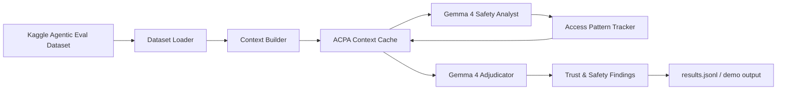

# Context Pruning for Gemma 4 Trust & Safety

This repository contains a reusable Trust & Safety research prototype for
agentic AI evaluation. It uses Gemma 4 as the reasoning model, Agentic Eval data
as the evaluation input, and an Adaptive Context Pruning Algorithm (ACPA) to
keep agentic safety reviews grounded while reducing noisy context. The project
is structured for hackathon demos, reproducible experiments, and peer-reviewed
publication artifacts.

## What this builds

- A Trust & Safety review pipeline for agent traces, prompts, and model outputs.
- A complete implementation of **Adaptive Context Pruning Algorithm (ACPA)** with
  LFU/LRU hybrid cache eviction and pinned citation/dependency preservation.
- A Gemma 4 client that reads API keys from config files instead of hard-coding
  secrets.
- A flexible Agentic Eval dataset loader for local files or Kaggle input
  directories.
- A Kaggle notebook entrypoint and a Mermaid architecture diagram.

## Architecture

See [`docs/architecture.md`](docs/architecture.md) for the full diagram and
component notes.



## Repository layout

```text
configs/
  app.example.toml       # Non-secret defaults
  secrets.example.toml   # API key shape; copy to secrets.toml locally/Kaggle
docs/
  architecture.md        # Mermaid architecture diagram and design notes
notebooks/
  kaggle_runner.py       # Kaggle notebook/script entrypoint
src/acpa_gemma/
  acpa.py                # Adaptive Context Pruning Algorithm
  cli.py                 # Command-line runner
  config.py              # Config and secret loading
  data.py                # Agentic Eval dataset loader
  gemma_client.py        # Gemma 4 API wrapper
  pipeline.py            # End-to-end Trust & Safety pipeline
  prompts.py             # Gemma prompts and output schema
tests/
  test_acpa.py
  test_config.py
```

## Configuration

Copy the example files and add your key locally or in the Kaggle notebook's
working directory:

```bash
cp configs/app.example.toml configs/app.toml
cp configs/secrets.example.toml configs/secrets.toml
```

Edit `configs/secrets.toml`:

```toml
[gemma]
api_key = "YOUR_GOOGLE_AI_STUDIO_OR_GEMINI_API_KEY"
```

The code searches these config files by default:

1. `configs/app.toml`
2. `configs/secrets.toml`
3. `/kaggle/working/configs/app.toml`
4. `/kaggle/working/configs/secrets.toml`
5. `~/.config/acpa_gemma/config.toml`
6. `~/.config/acpa_gemma/secrets.toml`

No API key is committed to this repository.

## Local usage

```bash
python3 -m venv .venv
source .venv/bin/activate
pip install -e ".[dev]"

python3 -m acpa_gemma.cli \
  --config configs/app.toml \
  --secrets configs/secrets.toml \
  --input /kaggle/input/agentic-eval \
  --output outputs/results.jsonl
```

For a no-network smoke test:

```bash
python3 -m acpa_gemma.cli --dry-run --sample-size 3 --output outputs/dry_run.jsonl
```

## Benchmark ACPA against baseline pruning

The benchmark runner does **not** require an API key. It compares ACPA with
existing/common context pruning strategies:

- no pruning
- random eviction
- LRU
- LFU
- importance-score ranking
- sliding-window truncation
- ACPA LFU/LRU/dependency pruning

Run locally or in Kaggle:

```bash
PYTHONPATH=src python3 -m acpa_gemma.benchmark \
  --input /kaggle/input/agentic-eval \
  --sample-size 100 \
  --details-output outputs/benchmark_details.csv \
  --summary-output outputs/benchmark_summary.csv \
  --report-output outputs/benchmark_report.md
```

If the Agentic Eval dataset is not present, the command falls back to the demo
record so you can still verify the code path.

Benchmark metrics include:

- context retention ratio
- token-reduction proxy
- citation/dependency preservation rate
- safety-keyword preservation rate
- retained-importance lift

## Kaggle usage

1. Create a Kaggle notebook or research experiment notebook.
2. Attach the Agentic Eval dataset to the notebook.
3. Upload or clone this repository.
4. Add your Google AI Studio / Gemini key using **Kaggle Secrets**:
   - Open the notebook right sidebar.
   - Click **Add-ons**.
   - Click **Secrets**.
   - Add label `GEMINI_API_KEY`.
   - Paste your API key as the value.
   - Enable notebook access for the secret.
5. Verify the secret in a Kaggle notebook cell:

```python
from kaggle_secrets import UserSecretsClient

secret_label = "GEMINI_API_KEY"
secret_value = UserSecretsClient().get_secret(secret_label)

print("API key loaded:", bool(secret_value))
```

Do not print `secret_value` itself.

6. If you are using `notebooks/context_pruning_kaggle_runner.ipynb`, run the
   first setup cell. It will clone this repository into
   `/kaggle/working/context-pruning` when `src/acpa_gemma` is not already
   present. Enable Kaggle notebook internet for that automatic clone path.
7. Run:

```bash
python3 notebooks/kaggle_runner.py \
  --input /kaggle/input/agentic-eval \
  --output /kaggle/working/results.jsonl
```

If you prefer a cell-by-cell notebook workflow, upload or copy
[`notebooks/context_pruning_kaggle_runner.ipynb`](notebooks/context_pruning_kaggle_runner.ipynb)
into your Kaggle notebook. It includes cells for dataset detection, config-file
creation, dry-run execution, benchmarking, and the real Gemma 4 run.

If the first notebook cell shows `SRC_ROOT exists = False`, the repo source code
is not available in the Kaggle runtime. Use the bootstrap cell in
[`docs/kaggle_bootstrap.md`](docs/kaggle_bootstrap.md), or refresh the notebook
from this branch so it can clone the repo automatically.

## Trust & Safety output schema

Each processed Agentic Eval record produces JSON with:

- `record_id`
- `risk_level`: `low`, `medium`, `high`, or `critical`
- `categories`: safety categories such as prompt injection, privacy,
  cyber abuse, fraud, or self-harm.
- `evidence`: short grounded snippets retained by ACPA.
- `mitigations`: actionable safety controls.
- `acpa_stats`: pruning and dependency-preservation telemetry.

## Why ACPA for Trust & Safety research

Agentic safety traces can be long and noisy. ACPA keeps frequently used,
important, recent, and citation-bearing context while evicting cold context.
This makes Gemma 4 reviews more focused and provides explainable memory
telemetry for transparency and reliability.