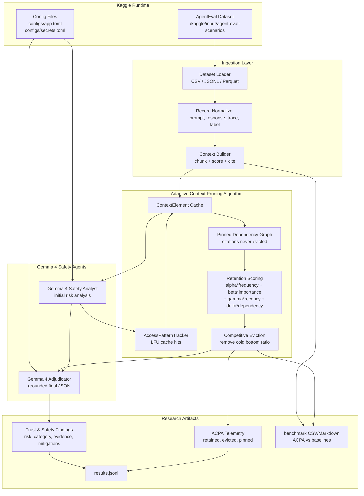

# Architecture Diagram

The Trust & Safety research pipeline combines Agentic Eval traces, ACPA memory
management, and Gemma 4 safety reasoning.



## Data flow

1. The Kaggle notebook mounts the AgentEval dataset under
   `/kaggle/input/agent-eval-scenarios`.
2. The loader discovers supported tabular files and normalizes each row into an
   `AgenticEvalRecord`.
3. The context builder splits prompts, trajectories, tool calls, responses, and
   labels into `ContextElement` objects.
4. Gemma 4 produces an initial Trust & Safety analysis.
5. The access tracker records which context elements Gemma referenced.
6. ACPA computes LFU/LRU/importance/dependency retention scores and prunes cold
   context while preserving citation-bearing evidence.
7. Gemma 4 adjudicates the final result using only the retained, grounded
   context and the initial analysis.
8. The pipeline writes JSONL records for analysis notebooks, hackathon demos,
   and publication appendices.

The offline benchmark path reuses the same ingestion and context builder, then
compares ACPA with no pruning, random eviction, LRU, LFU, importance ranking,
and sliding-window truncation. It writes per-record CSV details plus an
aggregate Markdown report without calling Gemma or requiring API keys.

## ACPA scoring

```text
score = alpha * frequency + beta * importance + gamma * recency + delta * dependency
```

- **frequency**: access count multiplied by cache priority.
- **importance**: lightweight safety-keyword and information-density score.
- **recency**: exponential LRU decay, `0.9 ** age`.
- **dependency**: pinned citation boost for evidence that must not be evicted.

The default `prune_ratio` is `0.45`, so ACPA removes approximately the coldest
45% of non-pinned context at each adjudication step.
